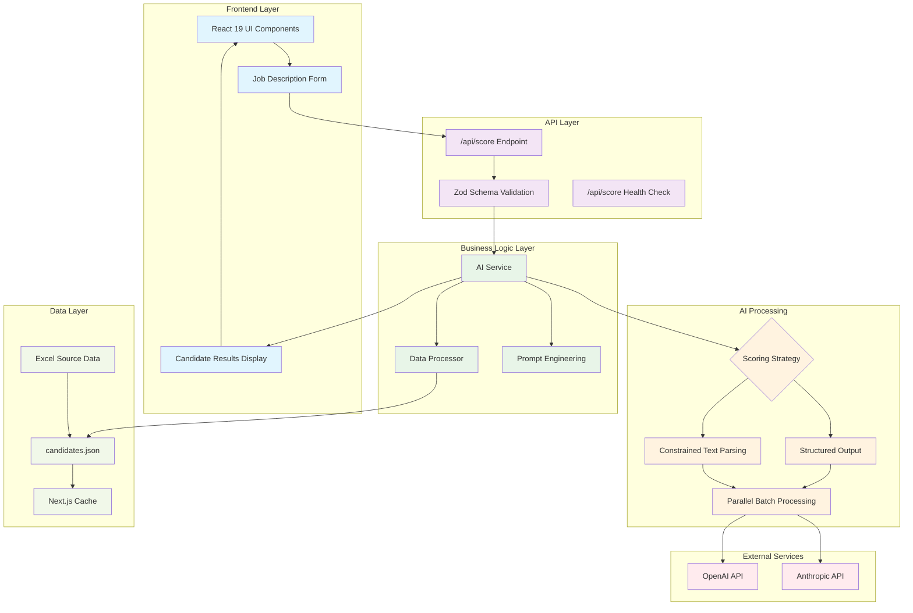
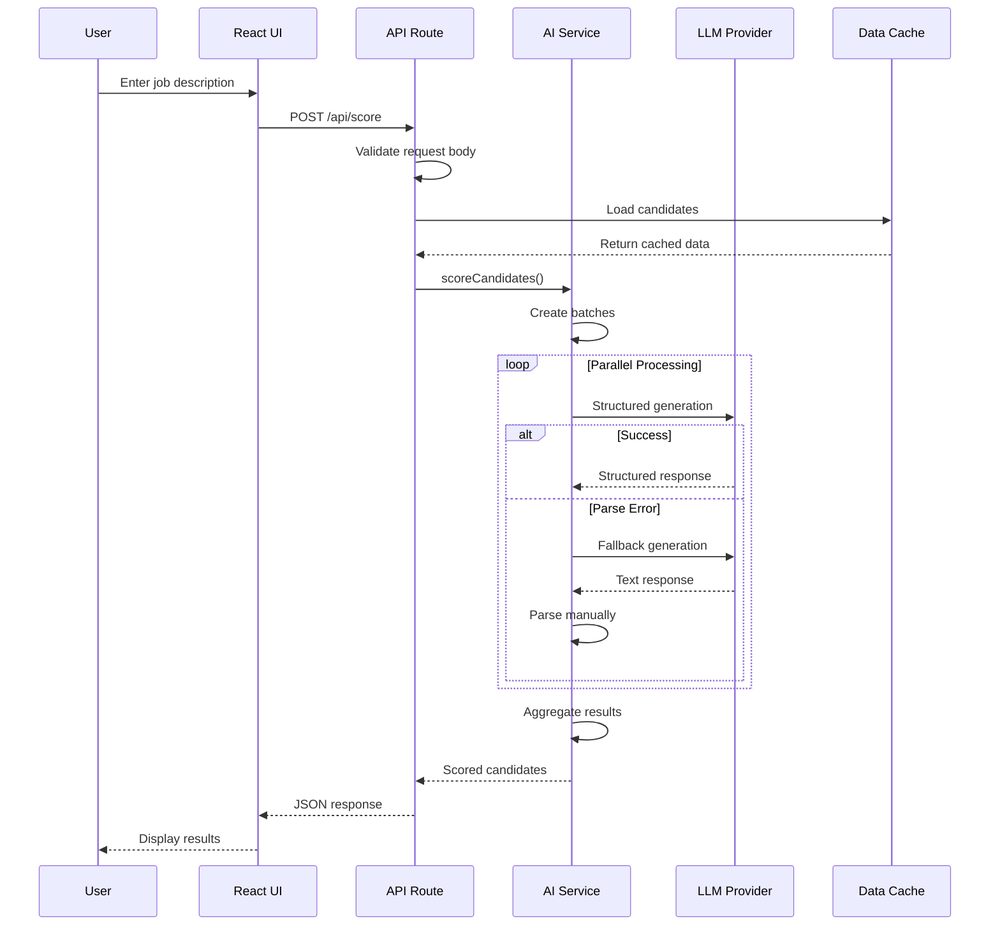
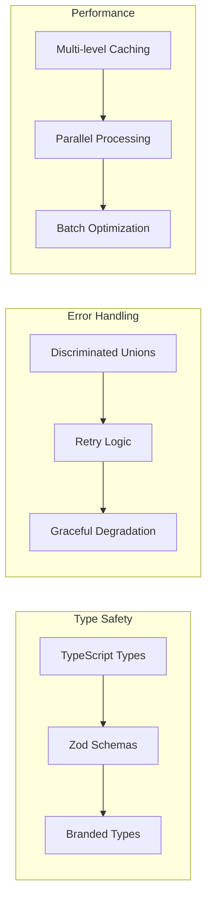

# Technical Report: LLM-Powered Candidate Screening System

## Architecture Overview

The LLM-Powered Candidate Screening System is a sophisticated TypeScript-first application built on Next.js 15 that leverages AI to intelligently rank and score candidates based on job descriptions. The system employs a multi-layered architecture with robust error handling, parallel processing, and dual AI strategies.

### System Architecture Diagram



### Component Interaction Flow



## Component Overview

### Core Components

1. **AI Service (`src/lib/ai-service.ts`)**
   - Central orchestrator for AI interactions
   - Implements dual strategy scoring (structured + fallback)
   - Handles batch processing with configurable concurrency
   - Provides comprehensive error handling and retry logic

2. **Data Processor (`src/lib/data-processor.ts`)**
   - Manages candidate data loading and caching
   - Converts Excel data to structured JSON format
   - Implements Next.js unstable_cache for performance

3. **Prompt Engineering (`src/lib/prompts.ts`)**
   - Contains system prompts and few-shot examples
   - Implements context-aware prompt generation
   - Provides structured output templates

4. **Type System (`src/lib/types.ts` & `src/lib/schemas.ts`)**
   - Comprehensive TypeScript definitions with branded types
   - Runtime validation with Zod schemas
   - Discriminated unions for exhaustive error handling

### Architecture Patterns



## Example Prompts and Design Rationale

### System Prompt Design

The system prompt establishes the AI as an expert technical recruiter with specific evaluation criteria:

```typescript
const SYSTEM_PROMPT = `You are an expert technical recruiter and hiring manager with deep expertise in evaluating software engineering candidates. Your role is to objectively score candidates based on how well they match a given job description.

SCORING CRITERIA (0-100 scale):
- Skills Match (40%): Technical skills alignment with job requirements
- Experience Level (25%): Years of experience and seniority match
- Education (15%): Formal education, certifications, continuous learning
- Portfolio (10%): Quality of projects, GitHub activity, contributions
- Availability (10%): Timeline match and location compatibility

EVALUATION GUIDELINES:
- Be objective and consistent in scoring
- Provide specific highlights that justify the score
- Include detailed reasoning for each candidate
- Identify matched skills explicitly
- Consider both hard and soft skills
- Account for potential and growth trajectory`;
```

**Design Rationale:**
- **Clear Persona**: Establishes expertise and authority
- **Weighted Criteria**: Provides transparent scoring methodology
- **Specific Guidelines**: Ensures consistent evaluation across candidates
- **Comprehensive Scope**: Covers technical and soft skills

### Few-Shot Examples

The system includes high-quality examples to guide AI behavior:

```typescript
const FEW_SHOT_EXAMPLES = [
  {
    input: `JOB: Senior React Developer, 5+ years, TypeScript, Node.js
CANDIDATE: John Smith
Skills: React, TypeScript, Node.js, GraphQL, AWS
Experience: 6 years
Portfolio: 3 major React applications, open-source contributor
Education: Computer Science degree
Availability: 2 weeks notice`,

    output: `{
  "candidates": [
    {
      "id": "john-smith-id",
      "score": 88,
      "highlights": [
        "Perfect technical stack match: React, TypeScript, Node.js",
        "6 years exceeds 5+ requirement",
        "Strong portfolio with 3 major applications",
        "Active open-source contributor",
        "Reasonable availability timeline"
      ],
      "reasoning": "Excellent technical match with all required skills. Experience level exceeds requirements. Strong portfolio demonstrates practical application of skills. Open-source contributions show passion and community involvement.",
      "matchedSkills": ["React", "TypeScript", "Node.js", "GraphQL", "AWS"]
    }
  ]
}`
  }
];
```

**Design Rationale:**
- **Realistic Scenarios**: Examples mirror actual hiring situations
- **Detailed Reasoning**: Shows how to justify scores
- **Consistent Format**: Ensures structured output
- **Balanced Evaluation**: Demonstrates fair assessment

### Context-Aware Prompts

The system adapts prompts based on job description keywords:

```typescript
export function generateContextualPrompt(
  jobDescription: JobDescription,
  candidates: ReadonlyArray<Candidate>
): string {
  const job = jobDescription.toLowerCase();
  let contextualPrompt = SYSTEM_PROMPT;

  if (job.includes("senior") || job.includes("lead")) {
    contextualPrompt += "\nADDITIONAL FOCUS: Evaluate leadership potential, architectural thinking, and mentoring capabilities.";
  }

  if (job.includes("remote")) {
    contextualPrompt += "\nADDITIONAL FOCUS: Consider remote work experience, communication skills, and ability to work independently.";
  }

  if (job.includes("startup")) {
    contextualPrompt += "\nADDITIONAL FOCUS: Value versatility, adaptability, and comfort with ambiguity and rapid change.";
  }

  return contextualPrompt;
}
```

**Design Rationale:**
- **Dynamic Adaptation**: Tailors evaluation to specific role requirements
- **Keyword Detection**: Simple but effective context recognition
- **Additive Approach**: Preserves base prompt while adding specificity
- **Scalable Pattern**: Easy to extend with new contexts

## Challenges Encountered and Solutions

### 1. AI Response Reliability

**Challenge:** LLM responses can be inconsistent, malformed, or fail to follow the expected JSON schema.

**Solution:** Implemented dual strategy scoring:
- **Primary Strategy**: Structured output with Zod schema validation
- **Fallback Strategy**: Constrained text parsing with manual validation

```typescript
async function scoreBatchWithStrategy(
  jobDescription: JobDescription,
  candidates: ReadonlyArray<Candidate>,
  strategy: ScoringStrategy,
  weights?: Partial<ScoringWeights>
): Promise<ScoringResult> {
  const provider = getLLMProvider();
  const model = getAIModel(provider);

  try {
    if (strategy === "structured") {
      const { object } = await generateObject({
        model,
        schema: AIScoreResponseSchema,
        prompt: createScoringPrompt(jobDescription, candidates, weights)
      });
      return { success: true, data: object.candidates };
    } else {
      const { text } = await generateText({
        model,
        prompt: createConstrainedPrompt(jobDescription, candidates)
      });
      const validation = validatePromptResponse(text);
      if (!validation.isValid) {
        return { success: false, error: { type: "PARSE_ERROR" } };
      }
      return { success: true, data: validation.parsed.candidates };
    }
  } catch (error) {
    return { success: false, error: mapErrorToScoringError(error) };
  }
}
```

### 2. Rate Limiting and API Quotas

**Challenge:** AI providers impose rate limits and quota restrictions that can cause processing failures.

**Solution:** Implemented sophisticated retry logic with exponential backoff:

```typescript
async function retryWithBackoff<T>(
  operation: () => Promise<T>,
  maxRetries: number = 3
): Promise<T> {
  let lastError: Error;

  for (let attempt = 0; attempt <= maxRetries; attempt++) {
    try {
      return await operation();
    } catch (error) {
      lastError = error as Error;

      if (isAPIError(error) && error.status === 429) {
        if (attempt < maxRetries) {
          const delay = calculateDelay(attempt);
          await new Promise(resolve => setTimeout(resolve, delay));
          continue;
        }
      }
    }
  }
  throw lastError!;
}

function calculateDelay(attempt: number): number {
  const delay = 1000 * Math.pow(2, attempt); // Exponential backoff
  return Math.min(delay, 10000); // Cap at 10 seconds
}
```

### 3. Large Dataset Processing

**Challenge:** Processing hundreds of candidates efficiently while respecting API limits.

**Solution:** Implemented parallel batch processing with configurable concurrency:

```typescript
const processParallelBatches = async (
  batches: ReadonlyArray<ReadonlyArray<Candidate>>,
  jobDescription: JobDescription,
  weights?: Partial<ScoringWeights>
): Promise<{
  scoredCandidates: ReadonlyArray<ScoredCandidate>;
  errors: ReadonlyArray<ScoringError>;
}> => {
  const maxConcurrentBatches = 3;
  const results: BatchResult[] = [];

  for (let i = 0; i < batches.length; i += maxConcurrentBatches) {
    const batchGroup = batches.slice(i, i + maxConcurrentBatches);
    const batchPromises = batchGroup.map((batch, groupIndex) =>
      processBatch(batch, i + groupIndex, jobDescription, weights)
    );
    
    const groupResults = await Promise.allSettled(batchPromises);
    results.push(...processedResults);
    
    // Rate limiting between batch groups
    if (i + maxConcurrentBatches < batches.length) {
      await delay(1000);
    }
  }

  return aggregateResults(results);
};
```

### 4. Type Safety with Dynamic AI Responses

**Challenge:** Ensuring type safety when dealing with dynamic AI-generated content.

**Solution:** Comprehensive type system with branded types and runtime validation:

```typescript
// Branded types for compile-time safety
export type CandidateId = string & { readonly __brand: "CandidateId" };
export type CandidateScore = number & { readonly __brand: "CandidateScore" };

// Runtime validation with Zod
export const AIScoreResponseSchema = z.object({
  candidates: z.array(z.object({
    id: z.string().transform(val => val as CandidateId),
    score: z.number().min(0).max(100).transform(val => val as CandidateScore),
    highlights: z.array(z.string()),
    reasoning: z.string(),
    matchedSkills: z.array(z.string())
  }))
});

// Discriminated unions for exhaustive error handling
export type ScoringError = 
  | { type: "RATE_LIMIT"; retryAfter: number; message: string }
  | { type: "QUOTA_EXCEEDED"; resetTime: Date; message: string }
  | { type: "VALIDATION_ERROR"; field: string; message: string }
  | { type: "PARSE_ERROR"; details: string; rawResponse?: string }
  | { type: "NETWORK_ERROR"; message: string; code?: string }
  | { type: "UNKNOWN_ERROR"; message: string };
```

### 5. Performance Optimization

**Challenge:** Balancing response time with processing accuracy for large candidate pools.

**Solution:** Multi-level optimization strategy:

1. **Caching**: Next.js unstable_cache for candidate data
2. **Batch Optimization**: Configurable batch sizes (default: 10 candidates)
3. **Parallel Processing**: Up to 3 concurrent batches
4. **Early Termination**: Stop processing on critical errors
5. **Result Limiting**: Return top N candidates (default: 30)

```typescript
export async function scoreCandidates(
  jobDescription: JobDescription,
  candidates: ReadonlyArray<Candidate>,
  options: {
    weights?: Partial<ScoringWeights>;
    batchSize?: number;
    maxResults?: number;
  } = {}
): Promise<ScoringResult> {
  const { batchSize = 10, maxResults = 30 } = options;
  
  const startTime = Date.now();
  const batches = createBatches(candidates, batchSize);
  
  const { scoredCandidates, errors } = await processParallelBatches(
    batches, jobDescription, options.weights
  );
  
  const sortedCandidates = sortAndLimitCandidates(scoredCandidates, maxResults);
  const processingTime = Date.now() - startTime;
  
  console.log(`Processed ${candidates.length} candidates in ${processingTime}ms`);
  
  return { success: true, data: sortedCandidates };
}
```

## Technology Decisions

### Framework Choice: Next.js 15

**Rationale:**
- **App Router**: Modern routing with server components
- **Turbopack**: Fast development builds
- **Built-in Caching**: unstable_cache for data persistence
- **API Routes**: Seamless backend integration
- **TypeScript Support**: First-class TypeScript integration

### AI SDK: Vercel AI SDK

**Rationale:**
- **Provider Abstraction**: Easy switching between OpenAI/Anthropic
- **Structured Output**: Built-in schema validation
- **Streaming Support**: Future-ready for real-time updates
- **Type Safety**: Excellent TypeScript integration
- **Error Handling**: Comprehensive error types

### Validation: Zod

**Rationale:**
- **Runtime Safety**: Validates data at runtime
- **TypeScript Integration**: Infers types from schemas
- **Composability**: Easy to build complex validations
- **Error Messages**: Clear validation error reporting
- **Performance**: Minimal runtime overhead
